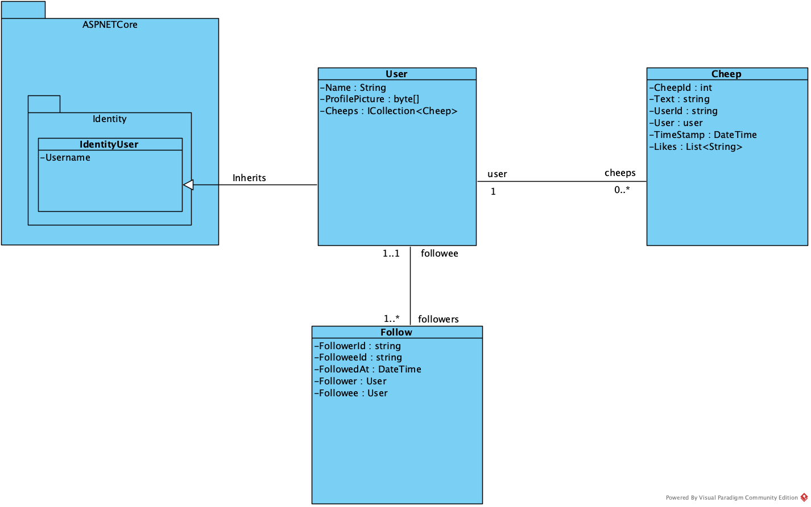
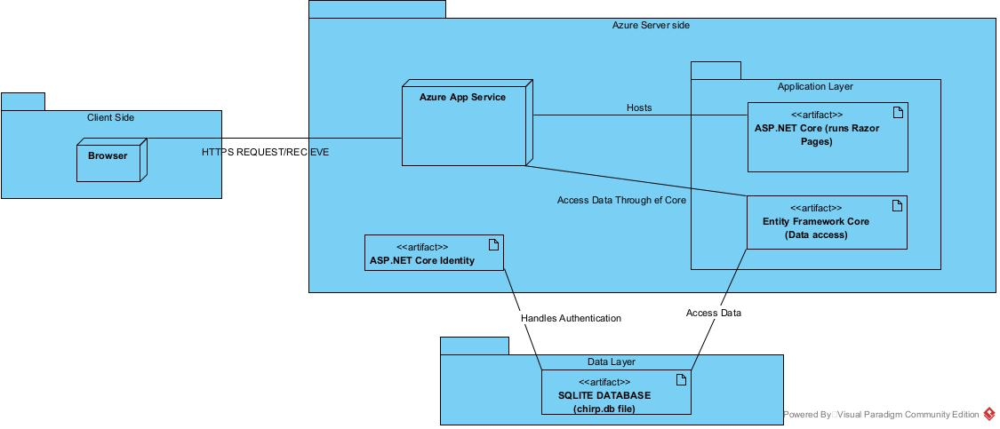
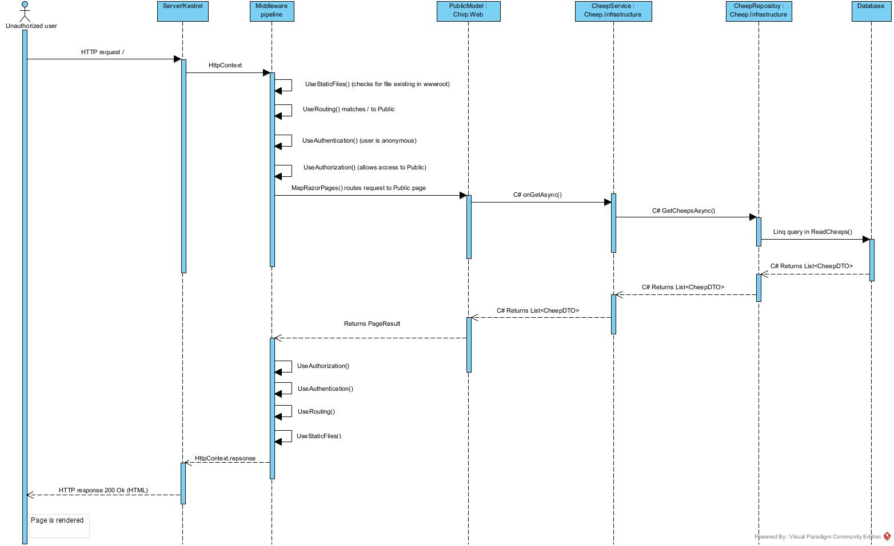

# Design and Architecture of _Chirp!_

## Domain model
Our domain model consists of two main elements, and one for infrastructure purposes:
- User

A 'User' is an entity who can write new Cheeps, and follow other Users. The relation from one user to another user describes a one-to-many relation, where one user can have many followers.
- Cheep

The 'Cheep' entity is the posts in the Chirp application. An author can write many Cheeps, which explains the one-to-many relation.
- Follow

The 'Follow' table keeps track of which users follow who, which can both be linked through UserID's, or an entity of a User class.

Below is a diagram visualising the relations between our different entities.

## Architecture — In the small

## Architecture of deployed application
Users send HTTPS requests from their browser (the client) to our application hosted on Azure. Azure runs our ASP.NET Core server, which processes requests using Razor Pages. The server accesses data from a SQLite database via Entity Framework Core and handles user authentication with ASP.NET Core Identity.

 

## User activities

## Sequence of functionality/calls trough _Chirp!_
This illustrates the flow of messages and data sent through our Chirp application. It is ilustrated for a unauthorized user sending a HTTP request to root endpoint, and ending up with a completely rendered web-page returned to the user.

Small comments on the middleware pipeline: 
Requests also go through the middlewares
UseExceptionHandler()
UseHsts()
UseHttpsRedirection()
When the app is not in development

We have chosen to show the process of going through middlewares as self-messages.

The middleware pipeline and Server/Kestrel lifeline is added as lifelines to completely show how the request is handled in ASP.NET (see figure 3.1 p. 32 ASP.NET Core IN ACTION third edition)

# Process

## Build, test, release, and deployment

## Team work

## How to make _Chirp!_ work locally

## How to run test suite locally

# Ethics

## License
We have chosen the MIT license, which is a common used license. The MIT license is a permissive license, which provides more freedom, if there were other who wanted to reuse the software. 
This includes:
- Commercial use
- Modification
- Distribution
- Private use

We chose a permissive license over a copyleft license, since we are developing our project for educational purposes. Since the project doesn't contain any business-critical logic, we don't need to enforce strict ownership.
## LLMs, ChatGPT, CoPilot, and others
